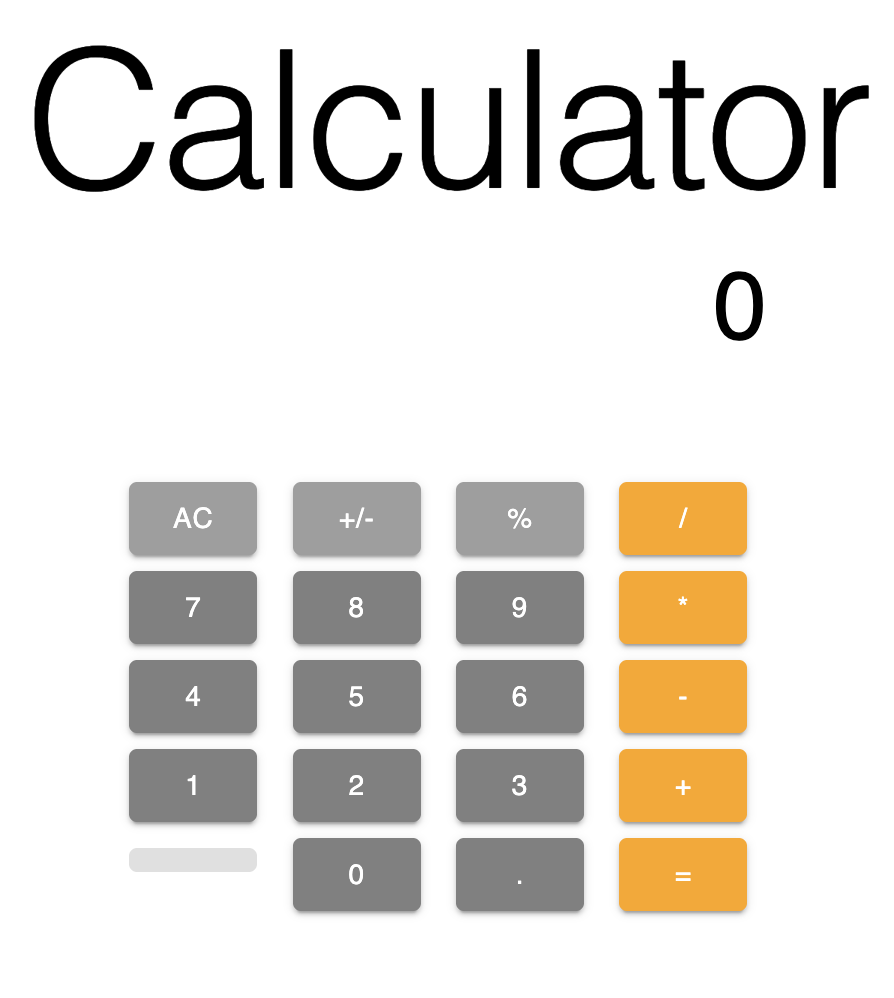

# React Calculator

A React calculator built with Vite, React, and Material UI.



## Logic

There are 3 important state variables: `display`, `result`, and `lastOperation`.
- Display: Necessary to show the user's raw (and valid) inputs to form an expression
- Result: Displays the result of the user's expression
- Last Operation: Stored to dictate how the UI should change depending on the last operation. This is primarily important for understanding what to do when the '=' operator is pressed.

To handle the buttons and their "schematics", I've built particular button click handlers according to their functions while keeping them somewhat reusable as possible, and setup the buttons as a set of configurations, so color, enable/disable across buttons is possible (`calcScheme`).

To be able to calculate the result:
- Values in `display` are space-separated to help with tokenizing and parsing and differentiating between numbers and operators 
- JS `eval` is used to be able to convert the parsed `display` into a proper `result`
  - Percentages (`%`) are not handled in `eval`, so values had to be sanitized to be able to perform the math as expected. 


## Requirements

The following requirements were followed:
1. Implement the AC, +/- and % functions
2. Able to handle the four basic operations + - / *
3. Displays a result when the = button is pressed

...However, some assumptions and limitations were made, please read below. 

## Limitations

1. Native JS is not good at handling floating point precision. Therefore, I forced precision is forced to 12 significant figures to alleviate the issue, but this means there is a lack of precision in the math when dealing with long float numbers.
2. Large number inputs become scrollable, which is a little difficult to see on Mac devices, plus it's not very elegant. Just a warning about that.
3. There could still be some bugs lurking around, although I tried my best to dogfood and eliminate them all.

## Assumptions

Since requirements were very simple and slightly ambiguous, I've followed these assumptions:

1. Implementation of this calculator is based off of how the iOS calculator looks and functions. This includes for instance:
   - The 'AC' function becomes a backspace function instead of clearing when an expression is being formed
   - When entering a number and operand and hitting '=', nothing happens, since the calculator is waiting for the 2nd number.
2. Precision is acceptable up to 12 sig figs (see Limitation 1)

## Criticisms / Notes

I'm well aware `eval` is a risky function, and should not be used due to posing security risks. 
However, for the sake of completing this calculator exercise in a short amount of time, this is the approach I came up with.

If this was meant to be a productionalized, I would consider multiple options like:
1. If I still use `eval`, improve my sanitize function further to ensure a non-number value could not possibly come through
2. Using a Math JS library (which also could help with precision)
3. Utilize something like ANTLR, which is a parser generator which already has the capability to process ["calculator"-like grammar](https://github.com/antlr/grammars-v4/blob/master/calculator/calculator.g4).

If I had more time, some other things to do would be:
1. Add Jest unit tests for the `helpers`
2. Add React Testing Library unit tests for the frontend components

## How to Run

To run locally:

```
npm install
npm run dev
```
